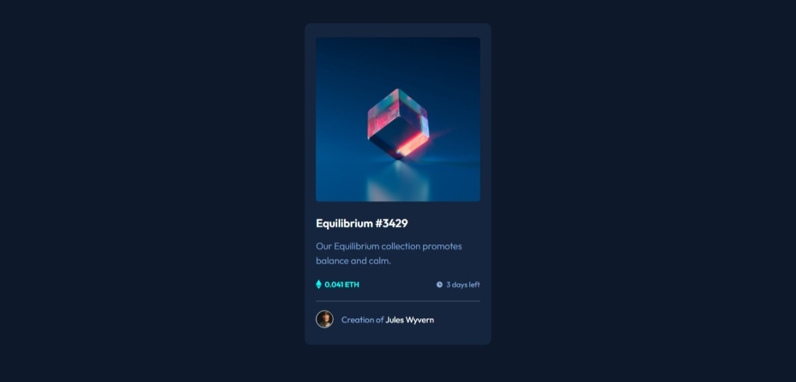

# Frontend Mentor - NFT preview card component solution

This is a solution to the [NFT preview card component challenge on Frontend Mentor](https://www.frontendmentor.io/challenges/nft-preview-card-component-SbdUL_w0U). Frontend Mentor challenges help you improve your coding skills by building realistic projects. 

## Table of contents

- [Overview](#overview)
  - [The challenge](#the-challenge)
  - [Screenshot](#screenshot)
  - [Links](#links)
- [My process](#my-process)
  - [Built with](#built-with)
  - [Useful resources](#useful-resources)
- [Author](#author)

## Overview

### The challenge

Users should be able to:

- View the optimal layout depending on their device's screen size
- See hover states for interactive elements

### Screenshot

### Links

- Solution URL: [Solution URL](https://github.com/SoulOfMo/nft-preview-card-component-main.git)
- Live Site URL: [Live Site](https://soulofmo.github.io/nft-preview-card-component-main/)

## My process

### Built with

- Semantic HTML5 markup
- CSS custom properties
- Flexbox

### Useful resources

- [Image Hover Text Overlay Effect with HTML & CSS](https://www.youtube.com/watch?v=exb2ab72Xhs&t=25s) - I was able to use and understand the position property better with the help of this video

## Author

- Frontend Mentor - [@soulofmo](https://www.frontendmentor.io/profile/SoulOfMO)
- Twitter - [@morin_sultan](https://www.twitter.com/morin_sultan)
